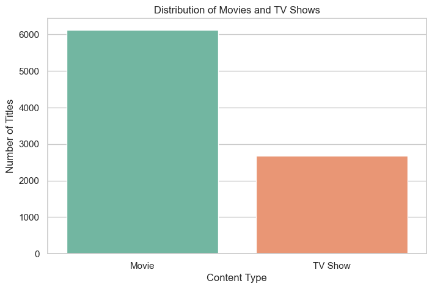
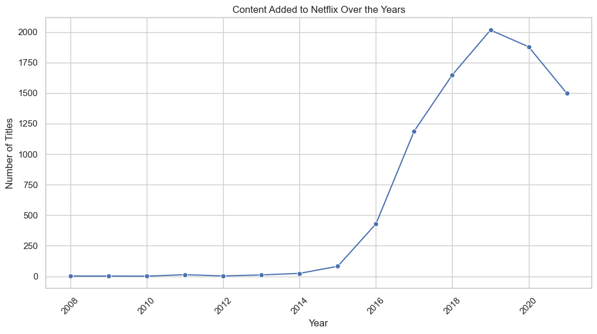
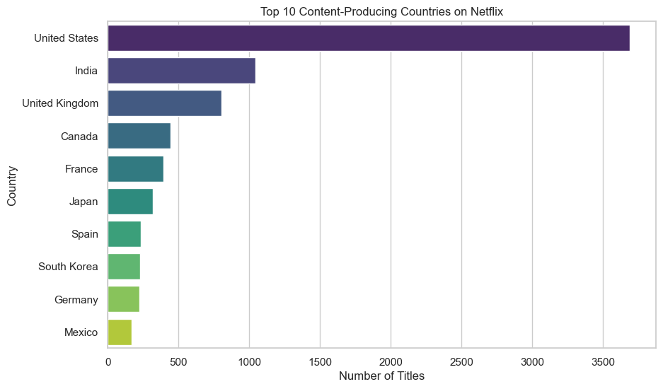
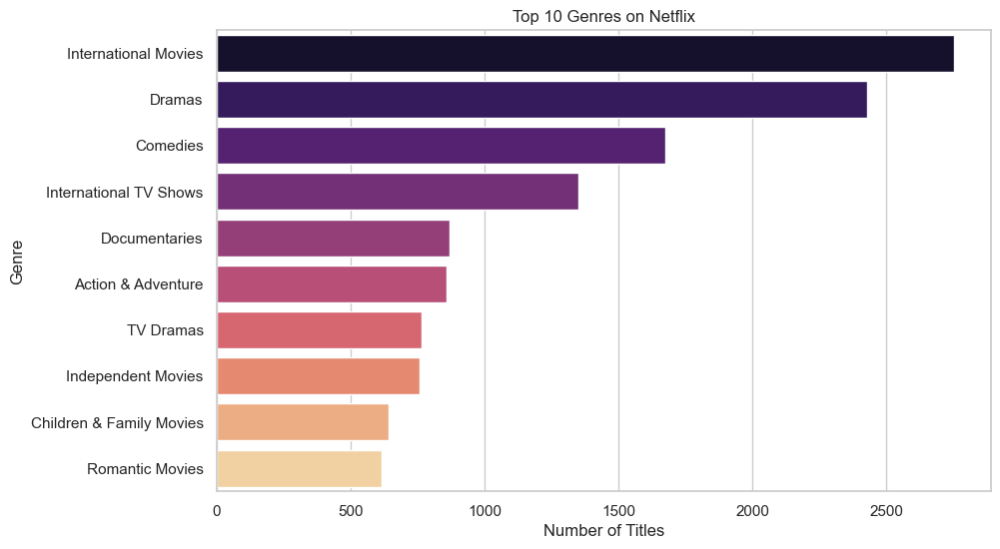
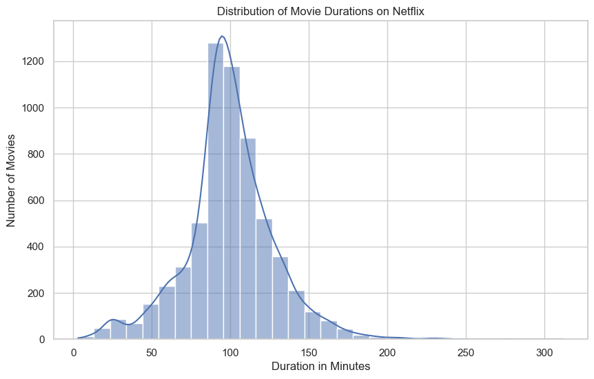

# 🎬 Netflix Content Analysis

## 📌 Project Overview

This project performs Exploratory Data Analysis (EDA) on the Netflix Movies and TV Shows dataset to uncover patterns and trends in Netflix's content library.

The analysis focuses on content types, growth over time, countries, genres, ratings, movie durations, and directors. The project demonstrates practical data cleaning, manipulation, analysis, and visualization using Python.

---

## 🎯 Objectives

- Analyze the distribution of Movies and TV Shows
- Explore how Netflix's content library has changed over time
- Identify the top content-producing countries
- Discover the most common genres
- Analyze the distribution of content ratings
- Explore movie duration patterns
- Compare Movies and TV Shows added over the years
- Identify directors with the most titles

---

## 🛠️ Technologies Used

- Python
- NumPy
- Pandas
- Matplotlib
- Seaborn
- Jupyter Notebook
- Visual Studio Code

---

## 📂 Project Structure

```text
Netflix-Content-Analysis/
│
├── data/
│   └── netflix_titles.csv
│
├── notebooks/
│   └── netflix_content_analysis.ipynb
│
├── images/
│   ├── movies_vs_tvshows.png
│   ├── content_added_over_years.png
│   ├── top_10_countries.png
│   ├── top_10_genres.png
│   └── movie_duration_distribution.png
│
├── README.md
├── requirements.txt
└── .gitignore
```

---

## 📊 Analysis Performed

### 1. Movies vs TV Shows
Analyzed the distribution of Movies and TV Shows available in the Netflix dataset.

### 2. Content Added Over the Years
Examined how the number of titles added to Netflix changed over time.

### 3. Top Content-Producing Countries
Identified the countries contributing the highest number of titles to the Netflix catalog.

### 4. Top Genres
Analyzed the most common genres and content categories available on Netflix.

### 5. Content Ratings
Explored the distribution of content ratings to understand the target audience of Netflix titles.

### 6. Movie Duration Analysis
Analyzed the distribution of movie durations to identify typical movie lengths.

### 7. Movies vs TV Shows Over Time
Compared the number of Movies and TV Shows added to Netflix each year.

### 8. Top Directors
Identified directors associated with the highest number of titles in the dataset.

---

## 🔍 Key Insights

- Movies make up the majority of the Netflix content in the dataset.
- Netflix's content library experienced significant growth over the years.
- The United States is one of the largest contributors of content to the platform.
- International Movies, Dramas, and Comedies are among the most common content categories.
- Mature and teen-oriented ratings represent a significant portion of the catalog.
- Most movies fall within a typical feature-film duration range.
- Movies generally accounted for more yearly additions than TV Shows.
- Several directors have contributed multiple titles to the Netflix catalog.

---

## 📈 Visualizations

### Movies vs TV Shows



### Content Added Over the Years



### Top 10 Content-Producing Countries



### Top 10 Genres



### Movie Duration Distribution



---

## 🚀 How to Run the Project

1. Clone this repository.
2. Install the required Python libraries:

```bash
pip install -r requirements.txt
```

3. Open:

```text
notebooks/netflix_content_analysis.ipynb
```

4. Run the notebook cells in order.

---

## 📚 Dataset

The project uses the **Netflix Movies and TV Shows** dataset containing information about titles available on Netflix, including content type, director, cast, country, release year, rating, duration, and genre.

---

## 👩‍💻 Author

**Anisha Raj**

B.Tech Artificial Intelligence and Machine Learning Student  
Interested in AI/ML, Data Analysis, and Software Development

---

## ⭐ Acknowledgement

This project was created as part of my learning journey in Python, data analysis, and data visualization.